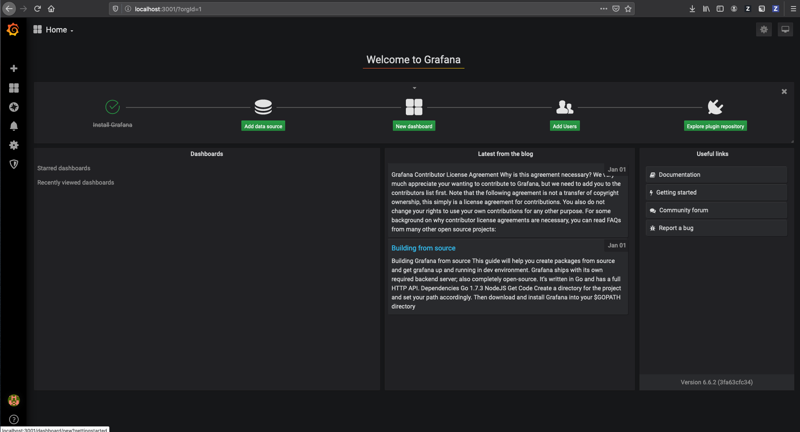
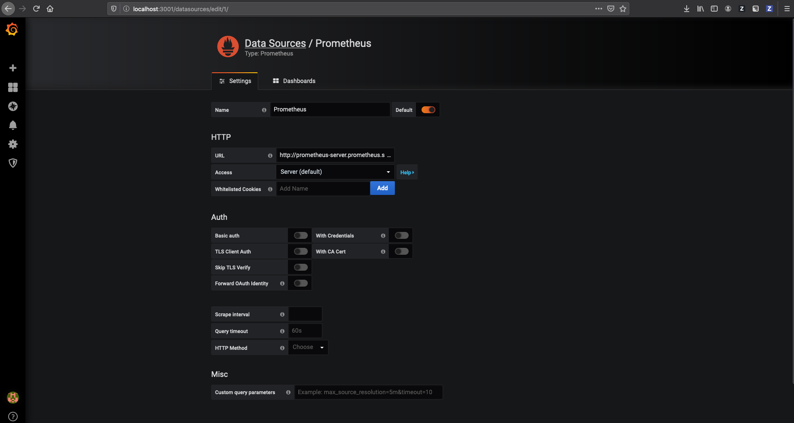
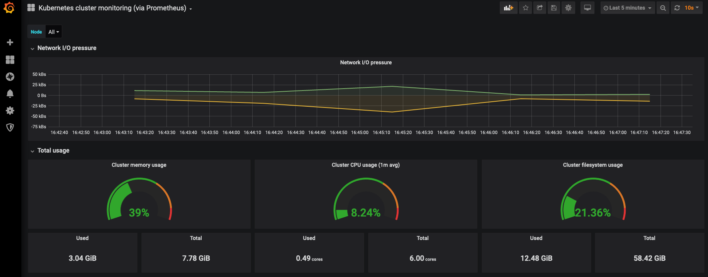
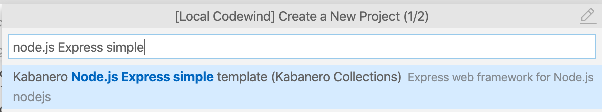

# Node.js in the Cloud

Welcome :wave: to the Node.js in the Cloud workshop at OpenJS World!

The workshop will be in three parts:
  1. [Extending a simple Express.js application to leverage cloud capabilities](#part-1-extending-an-expressjs-application-to-leverage-cloud-capabilities)
  2. [Demonstrate tooling to help you develop all of your cloud-native applications from a consistent base](#part-2-building-cloud-native-apps-with-appsody)
  3. [Introducing Kabanero](#part-3-introducing-kabanero)

## Part 1: Extending an Express.js application to leverage Cloud Capabilities

### Building a Cloud-Ready Express.js Application

This will show you how to take a Node.js application and make it "cloud-ready": adding support for Cloud Native Computing Foundation (CNCF) technologies using the package and templates provided by the [CloudNativeJS](https://www.cloudnativejs.io/) project.

In this self-paced tutorial, you will:

* Create an Express.js application
* Add Health Checks and Metrics to your application
* Build your application with Docker
* Package your application with Helm
* Deploy your application to Kubernetes
* Monitor your application using Prometheus

The application you'll use is a simple Express.js app built using the Express Generator. You'll learn about Health Checks, Metrics, Docker, Kubernetes, Prometheus and Grafana. At the end you'll have a fully functioning application running as a cluster in Kubernetes, with production monitoring.

### Prerequisites

Before getting started, make sure you have the following prerequisites installed on your system.

1. [Node.js 10 or later](https://nodejs.org/en/download/) or using [nvm](https://github.com/nvm-sh/nvm#installation-and-update)
2. Visual Studio Code
3. Docker and Kubernetes
   - ***On Mac or Windows***: [Docker for Desktop](https://www.docker.com/products/docker-desktop)
   - ***On Linux***: Docker for Desktop is not available, follow the docker for linux instructions below and Kubernetes alternatives are:
    - [minikube](https://kubernetes.io/docs/tasks/tools/install-minikube/)
    - [microk8s](https://microk8s.io/#quick-start)
4. Helm v3 - https://helm.sh/docs/intro/install/
   - **Note**: This workshop tested with Helm v3.1.2

### Setting up

How to start Kubernetes will depend on how you intend to run it.

#### Starting Kubernetes

#### `Docker for Desktop`

Ensure you have installed Docker for Desktop and enabled Kubernetes within the application. To do so:

On macOS:
1. Select the Docker icon in the Menu Bar
2. Click `Preferences/Settings > Kubernetes Tab > Enable Kubernetes`.

On Windows:
1. Select the Docker icon in the notifiation area of the taskbar.
2. Click `Settings > Kubernetes Tab > Enable Kubernetes`.

It will take a few moments to install and start-up. If you already use Kubernetes, ensure that you are configured to use the `docker-for-desktop` cluster. To do so:

1. Select the Docker icon in the Menu Bar
2. Click `Kubernetes` and select the `docker-for-desktop` context

#### Docker on linux

<details>
Install Docker Engine Community using

```sh
sudo apt-get install docker-ce docker-ce-cli containerd.io
```

More information can be found at https://docs.docker.com/install/linux/docker-ce/ubuntu/

Add the user to the docker group (optional for part 1, required for part 2 and 3)

```sh
sudo groupadd docker
sudo gpasswd -a $USER docker
sudo service docker restart
```

Install docker compose

```sh
sudo apt install docker-compose
```

</details>

#### `microk8s`

<details>

```sh
snap install --channel 1.14/stable microk8s --classic
sudo usermod -a -G microk8s ibmuser
sudo microk8s.start
sudo snap alias microk8s.kubectl kubectl
export PATH=/snap/bin:$PATH
sudo microk8s.config >~/.kube/config
microk8s.enable dns registry
```

You may be prompted to add your userid to the 'microk8s' group to avoid having to use `sudo` for all the commands.

**Note**: The Prometheus Helm chart is
[not compatible](https://github.com/helm/charts/pull/17268) with
Kubernetes 1.16, so make sure to install 1.14.

</details>

#### `minikube`

<details>

```sh
minikube start --kubernetes-version=1.14.7
eval $(minikube docker-env)
```

**Note** that the Prometheus Helm chart is
[not compatible](https://github.com/helm/charts/pull/17268) with
Kubernetes 1.16, so make sure to run with 1.14.7.
</details>

#### Installing Helm

Helm is a package manager for Kubernetes. By installing a Helm "chart" into your Kubernetes cluster you can quickly run all kinds of different applications. You can install Helm using one of the options below:

**Using a Package Manager:**

* macOS with Homebrew: `brew install helm`
* Linux with Snap: `sudo snap install helm --classic`
* Windows with Chocolatey: `choco install kubernetes-helm`

**Using a Script:**

```sh
$ curl -fsSL -o get_helm.sh https://raw.githubusercontent.com/helm/helm/master/scripts/get-helm-3
$ chmod 700 get_helm.sh
$ ./get_helm.sh
```

Now that Helm is installed, you should also configure access to the "stable" Helm repository as follows:

```sh
helm repo add stable https://kubernetes-charts.storage.googleapis.com
```

This makes it easy for you to install a number of applications and services into your Kubernetes cluster. You'll use this to install Prometheus and Grafana later in the workshop.

### 1. Create your Express.js Application

Use the following steps to create your Express.js application:

1. Create a directory to host your project

   ```sh
   mkdir nodeserver
   cd nodeserver
   ```

2. Run the Express generator to build your skeleton application:

   ```sh
   npx express-generator --view=ejs
   npm version 1.0.0
   ```
   
   **Note**: `express-generator` still uses `var`.

This has built a simple Express.js application called `nodeserver`, after the name of the directory you are in.

3. Install your applications dependencies and start your application:

    ```sh
    npm install
    npm start
    ```

Your application should now be visible at [http://localhost:3000](http://localhost:3000).

### 2. Add Health Checks to your Application

Kubernetes, and a number of other cloud deployment technologies, provide "Health Checking" as a system that allows the cloud deployment technology to monitor the deployed application and to take action should the application fail or report itself as "unhealthy".

The simplest form of Health Check is process level health checking, where Kubernetes checks to see if the application process still exists and restarts the container (and therefore the application process) if it is not. This provides a basic restart capability but does not handle scenarios where the application exists but is un-responsive, or where it would be desirable to restart the application for other reasons.

The next level of Health Check is HTTP based, where the application exposes a "livenessProbe" URL endpoint that Kubernetes can make requests of in order to determine whether the application is running and responsive. Additionally, the request can be used to drive self-checking capabilities in the application.

The `@cloudnative/health-connect` package provides a Connect Middleware that makes it easy to add a default health check endpoint and provides a Promise based API for adding self-checking capabilities. The module is written in TypeScript. In this workshop we will be using `var` for consistency with the `express-generator`.

Add a Health Check endpoint to your Express.js application using the following steps:

1. Add the `@cloudnative/health-connect` dependency to your project:
   
   ```sh
   npm install @cloudnative/health-connect
   ```

2. Set up a HealthChecker in `app.js` with the following code:

   ```js
   // Health Check setup
   var health = require('@cloudnative/health-connect');
   var healthcheck = new health.HealthChecker();
   ```

   **Note**: It's recommended to add the HeathCheck setup near the other requires, prior to Line 10 in `app.js`.
   
3. Register a Liveness endpoint in `app.js`:

   ```js
   app.use('/health', health.LivenessEndpoint(healthcheck));
   ```
   
 Add this line after the `app.use('/users', usersRouter);` line but before the 404 catch handler. This adds a `/health` endpoint to your application. As no liveness checks are registered, it will return as status code of 200 OK and a JSON payload of `{"status":"UP","checks":[]}`.

Check that your `livenessProbe` Health Check endpoint is running:

1. Start your application:

   ```sh
   npm start
   ```

2. Visit the `health` endpoint [http://localhost:3000/health](http://localhost:3000/health).

For information on how to register health/liveness checks, and additional support for start-up, readiness and shutdown checks, see the [Cloud Health documentation](https://github.com/CloudNativeJS/cloud-health/blob/master/README.md).

### 3. Add Metrics to your Application

For any application deployed to a cloud, it is important that the application is "observable": that you have sufficient information about an application and its dependencies such that it is possible to discover, understand and diagnose the state of the application. One important aspect of application observability is metrics-based monitoring data for the application.

The CNCF recommended metrics system is [Prometheus](http://prometheus.io), which works by collecting metrics data by making requests of a URL endpoint provided by the application. Prometheus is widely supported inside Kubernetes, meaning that Prometheus also collects data from Kubernetes itself, and application data provided to Prometheus can also be used to automatically scale your application.

The `prom-client` package provides an easy to use library that auto-instruments your application to collect metrics. It is then possible to expose the metrics on an endpoint for consumption by Prometheus.

Add a `/metrics` Prometheus endpoint to your Express.js application using the following steps:

1. Add the `prom-client` dependency to your project:
   
   ```sh
   npm install prom-client
   ```

2. Require `prom-client` in `app.js` and choose to configure default metrics:

   ```js
   // Prometheus client setup
   var Prometheus = require('prom-client');
   Prometheus.collectDefaultMetrics(); 
   ```

    It is recommended to add this just after your Health Check setup.

3. Register a `/metrics` route to serve the data on:

   ```js
   app.get('/metrics', (req, res, next) => {
      res.set('Content-Type', Prometheus.register.contentType);
      res.end(Prometheus.register.metrics());
   });   
   ```
   
You'll also need to register the `app.get('/metrics')...` route before the 404 catch handlers. This adds a `/metrics` endpoint to your application. This automatically starts collecting data from your application and exposes it in a format that Prometheus understands.

Check that your metrics endpoint is running:

1. Start your application:

   ```sh
   npm start
   ```

2. Visit the `metrics` endpoint [http://localhost:3000/metrics](http://localhost:3000/metrics).

For information on how to configure the `prom-client` library see the [prom-client documentation](https://github.com/siimon/prom-client#prometheus-client-for-nodejs---).

You can install a local Prometheus server to graph and visualize the data, and additionally to set up alerts. For this workshop you'll use Prometheus once you've deployed your application to Kubernetes.

### 4. Building your Application with Docker

Before you can deploy your application to Kubernetes, you first need to build your application into a Docker container and produce a Docker image. This packages your application along with all of its dependencies in a ready to run format.

CloudNativeJS provides a "[Docker](https://github.com/CloudNativeJS/docker)" project that provides a number of best-practice Dockerfile templates that can be used to build your Docker container and produce your image.

For this workshop, you'll use the `Dockerfile-run` template, which builds a production-ready Docker image for your application.

Build a production Docker image for your Express.js application using the following steps:

1. Copy the `Dockerfile-run` template into the root of your project:

   ```sh
   curl -fsSL -o Dockerfile-run https://raw.githubusercontent.com/CloudNativeJS/docker/master/Dockerfile-run
   ```
   
2. Copy the `.dockerignore` file into the root of your project:

   ```sh
   curl -fsSL -o .dockerignore https://raw.githubusercontent.com/CloudNativeJS/docker/master/.dockerignore
   ```

3. Build the Docker run image for your application:

   ```sh
   docker build --tag nodeserver-run:1.0.0 --file Dockerfile-run .
   ```
   
You have now built a Docker image for your application called `nodeserver-run` with a version of `1.0.0`. Use the following to run your application inside the Docker container:

  ```sh
  docker run --interactive --publish 3000:3000 --tty nodeserver-run:1.0.0
  ```

This runs your Docker image in a Docker container, mapping port 3000 from the container to port 3000 on your laptop so that you can access the application.

<details>
<summary>minikube only</summary>

Docker runs in the minikube VM, so an additional step is
required to expose the application to localhost:
```sh
kubectl port-forward service/nodeserver-service 3000
```
</details>

Visit your applications endpoints to check that it is running successfully:

* Homepage: [http://localhost:3000/](http://localhost:3000/)
* Health: [http://localhost:3000/health](http://localhost:3000/health)
* Metrics: [http://localhost:3000/metrics](http://localhost:3000/metrics)

## 5. Packaging your Application with Helm

In order to deploy your Docker image to Kubernetes you need to supply Kubernetes with configuration on how you need your application to be run, including which Docker image to use, how many replicas (instances) to deploy and much memory and CPU to provide to each.

Helm charts provide an easy way to package your application with this information. 

CloudNativeJS provides a "[Helm](https://github.com/CloudNativeJS/helm)" project that provides a template best-practice Helm chart template that can be used to package your application for Kubernetes.

Add a Helm chart for your Express.js application using the following steps:

1. Download the template Helm chart:

   ```sh
   curl -fsSL -o master.tar.gz https://github.com/CloudNativeJS/helm/archive/master.tar.gz
   ```

2. Unzip the downloaded template chart:

   ```sh
   tar xfz master.tar.gz
   ```

3. Move the chart to your projects root directory:

   On Linux and macOS:
   ```sh
   mv helm-master/chart chart
   rm -rf helm-master master.zip
   ```
   
   On Windows:
   ```
   move helm-master\chart chart
   rmdir /s /q helm-master
   del master.tar.gz
   ```
	
The provided Helm chart provides a number of configuration files, with the configurable values extracted into `chart/nodeserver/values.yaml`. In this file you provide the name of the Docker image to use, the number of replicas (instances) to deploy, etc.

Go ahead and modify the `chart/nodeserver/values.yaml` file to use your image, and to deploy 3 replicas:

1. Open the `chart/nodeserver/values.yaml` file
2. Change the `repository` field to `nodeserver-run`
3. Ensure that the `pullPolicy` is set to `IfNotPresent`
4. Change the `replicaCount` value to `3` (Line 3)

The `repository` field gives the name of the Docker image to use. The `pullPolicy` change tells Kubernetes to use a local Docker image if there is one available rather than always pulling the Docker image from a remote repository. Finally, the `replicaCount` states how many instances to deploy.
 
## 6. Deploying your Application to Kubernetes

Now that you have built a Helm chart for your application, the process for deploying your application has been greatly simplified.

Deploy your Express.js application into Kubernetes using the following steps:

<details>
<summary>microk8s only</summary>

You will need to push the image into the kubernetes container registry so that microk8s can access it. 

```sh
docker tag nodeserver-run:1.0.0 localhost:32000/nodeserver-run:1.0.0
docker push localhost:32000/nodeserver-run:1.0.0
helm install nodeserver \
  --set image.repository=localhost:32000/nodeserver-run  chart/nodeserver
```
</details>


1. Deploy your application into Kubernetes:

   ```sh
   helm install nodeserver chart/nodeserver
   ```


**Note**: If an error is encountered because the previous `docker run` is still running,delete and retry the helm install:

   ```sh
   helm del --purge nodeserver
   helm install nodeserver chart/nodeserver
   ```

2. Ensure that all the "pods" associated with your application are running:

   ```sh
   kubectl get pods
   ```

Now everything is up and running in Kubernetes. It is not possible to navigate to `localhost:3000` as usual because your cluster isn't part of the localhost network, and because there are several instances to choose from.

You can forward the nodeserver-service to your laptop by:

  ```sh
  kubectl port-forward service/nodeserver-service 3000
  ```

You can now access the application endpoints from your browser.

## 7. Monitoring your Application with Prometheus

Installing Prometheus into Kubernetes can be done using its provided Helm chart. This step needs to be done in a new Terminal window as you'll need to keep the application port-forwarded to `localhost:3000`.

  ```sh
  kubectl create namespace prometheus
  kubectl config set-context --current --namespace=prometheus
  helm install prometheus stable/prometheus --namespace=prometheus
  ```

You can then run the following two commands in order to be able to connect to Prometheus from your browser:

  On Linux and macOS:
  ```sh
  export POD_NAME=$(kubectl get pods --namespace prometheus -l "app=prometheus,component=server" -o jsonpath="{.items[0].metadata.name}")
  kubectl --namespace prometheus port-forward $POD_NAME 9090
  ```
  
  On Windows:
  ```
  for /f "tokens=*" %i in ('"kubectl get pods --namespace prometheus -l app=prometheus,component=server -o jsonpath={.items[0].metadata.name}"') do set POD_NAME=%i
  kubectl --namespace prometheus port-forward %POD_NAME% 9090
  ```

This may fail with a warning about status being "Pending" until Prometheus has started, retry once status is "Running" for all pods:
  ```sh
  kubectl -n prometheus get pods --watch
  ```

You can now connect to Prometheus at [http://localhost:9090](http://localhost:9090).

This should show the following screen:


Prometheus will be automatically collecting data from your Express.js application, allowing you to create graphs of your data.

To build your first graph, type `nodejs_heap_size_used_bytes` into the **Expression** box and click on the **Graph** tab.

This will show a graph mapping the `nodejs_heap_size_used_bytes` across each of the three pods. You'll probably want to reduce the graph interval to `1m` (1 minute) so that you can start seeing the changes in the graph. You can also try sending some requests to your server (http://localhost:3000) in another browser window to add load to the server, which you should then see reflected in the graph. 


<details>
<summary>microk8s only</summary>

If you encounter a problem where there are no nodejs metrics in the **Expression** box, your Prometheus deployment may not be scraping metrics form the nodeserver. To check your microk8s cluster is setup ok run the following command:

```sh
microk8s.inspect
```

You may see the following warning

```sh
WARNING:  IPtables FORWARD policy is DROP. Consider enabling traffic forwarding with: sudo iptables -P FORWARD ACCEPT
The change can be made persistent with: sudo apt-get install iptables-persistent
```

To fix this warning run the following command which will ensure packets sent to/from your pods can be forwarded. This change is also non-persistent.

```sh
sudo iptables -P FORWARD ACCEPT
```

More microk8s troubleshooting information can be found here: https://microk8s.io/docs/troubleshooting

</details>

Whilst Prometheus provides the ability to build simple graphs and alerts, Grafana is commonly used to build more sophisticated dashboards.

### Installing Grafana into Kubernetes

Installing Grafana into Kubernetes can be done using its provided Helm chart.

In a third Terminal window:

```sh
kubectl create namespace grafana
kubectl config set-context --current --namespace=grafana
helm install grafana stable/grafana --set adminPassword=PASSWORD --namespace=grafana
```

You can then run the following two commands in order to be able to connect to Grafana from your browser:

  On Linux and macOS:
  ```sh
  export POD_NAME=$(kubectl get pods --namespace grafana -o jsonpath="{.items[0].metadata.name}")
  kubectl --namespace grafana port-forward $POD_NAME 3001:3000
  ```

  On Windows:
  ```
  for /f "tokens=*" %i in ('"kubectl get pods --namespace grafana -o jsonpath={.items[0].metadata.name}"') do set POD_NAME=%i
  kubectl --namespace grafana port-forward %POD_NAME% 3001:3000
  ```

You can now connect to Grafana at the following address, using `admin` and `PASSWORD` to login:

* [http://localhost:3001](http://localhost:3001)

This should show the following screen:



In order to connect Grafana to the Prometheus service, go to http://localhost:3001/datasources and click `Add Data Source`. Select `Prometheus`.

This opens the a panel that should be filled out with the following entries:

* Name: `Prometheus`
* URL: `http://prometheus-server.prometheus.svc.cluster.local`



Now click on `Save & Test` to check the connection and save the Data Source configuration.

Grafana now has access to the data from Prometheus.

### Installing a Kubernetes Dashboard into Grafana

The Grafana community provides a large number of pre-created dashboards which are available for download, including some which are designed to display Kubernetes data.

To install one of those dashboards, click on the `+` icon and select `Import`.

In the provided panel, enter `1621` into the `Grafana.com Dashboard` field in order to import dashboard number 1621, and press `Tab`.

**Note**: If `1621` is not recognized, it may be necessary to download the JSON for [1621](https://grafana.com/grafana/dashboards/1621) (select `Download JSON`), and use `Upload JSON` in the Grafana UI.

This then loads the information on dashboard `1621` from Grafana.com.


Change the `Prometheus` field so that it is set to `Prometheus` and click `Import`.

This will then open the dashboard, which will automatically start populating with data about your Kubernetes cluster.



### Adding Custom Graphs

In order to extend the dashboard with your own graphs, click the `Add panel` icon on the top toolbar and select `Graph`.

On some Grafana versions, after you click `Add panel` in toolbar, it is necessary to select `Choose Visualization` before selecting `Graph`.

This creates a blank graph. Select the `Panel Title` pull down menu and select `Edit`.

This opens an editor panel where you can select data that you'd like to graph.

Type `nodejs_heap_size_used_bytes` into the data box (or `Metrics` box on some version of Grafana), and a graph of your applications CPU data will show on the panel. You may need to click the `Queries` icon on the left to access the data box.


You now have integrated monitoring for both your Kubernetes cluster and your deployed Express.js application.

### Congratulations! 🎉

You now have an Express.js application deployed with scaling using Docker and Kubernetes, with automatic restart, and full metrics-based monitoring enabled!

Once you are finished, you should exit all the running terminal processes with `CTRL + C`, and then use the following commands to delete the helm releases and remove your Kubernetes pods:

```sh
helm delete nodeserver -n default
helm delete prometheus -n prometheus
helm delete grafana -n grafana
```

To change your Kubernetes context back to default use:

```sh
kubectl config set-context --current --namespace=default
```

## Part 2: Building Cloud-Native Apps with Appsody

### Introduction to Appsody

Appsody is designed to help you develop containerized applications for the cloud.

Imagine you've defined your chosen cloud technologies, and you want to reuse these technologies across all of your Node.js micro-services. You can use Appsody to define the standards for your applications, which will allow you to control the base that all of your applications are built off. You can define a set of technologies that are configurable, reusable, and already infused with cloud native capabilities. You can then maintain your standards, ensuring consistency and reliability.

This also means that not all software developers in your organization need to have the knowledge or burden of managing the full cloud-native software development stack. With Appsody, developers can build applications for the cloud that are ready to be deployed to Kubernetes without necessarily being an expert on the underlying container technology.

For more background information on Appsody - checkout [this Medium article](https://medium.com/appsody/overview-c0cf1f2a244c).

### Prerequisites

Before getting started, you’ll need to install the Appsody CLI.

1. Follow the [Installing Appsody](https://appsody.dev/docs/getting-started/installation#installing-appsody) guide to install the CLI for your platform.

Verify that Appsody is installed by typing `appsody version`.

Next ensure you are in the default Kubernetes namespace:

On Linux and macOS:
```shell
kubectl config view --minify | grep namespace:
```

On Windows:
```
kubectl config view --minify | find "namespace:"
```

If you are not in the default namespace use the following to switch back to the default namespace:

```shell
kubectl config set-context --current --namespace=default
```

### 1. Getting to know Appsody

`appsody`

You should see output similar to the following:

```
The Appsody command-line tool (CLI) enables the rapid development of cloud native applications.

Complete documentation is available at [https://appsody.dev](https://appsody.dev).

Usage:
  appsody [command]

Available Commands:
  build       Locally build a docker image of your appsody project
  completion  Generates bash tab completions
  debug       Run the local Appsody environment in debug mode
  deploy      Build and deploy your Appsody project to your Kubernetes cluster
  extract     Extract the stack and your Appsody project to a local directory
  help        Help about any command
  init        Initialize an Appsody project with a stack and template app
  list        List the Appsody stacks available to init
  operator    Install or uninstall the Appsody operator from your Kubernetes cluster.
  repo        Manage your Appsody repositories
  run         Run the local Appsody environment for your project
  stop        Stops the local Appsody docker container for your project
  test        Test your project in the local Appsody environment
  version     Show Appsody CLI version

Flags:
      --config string   config file (default is $HOME/.appsody/.appsody.yaml)
      --dryrun          Turns on dry run mode
  -h, --help            help for appsody
  -v, --verbose         Turns on debug output and logging to a file in $HOME/.appsody/logs

Use "appsody [command] --help" for more information about a command.
```

Let’s take a look at which pre-built stacks we have available by entering:

```sh
appsody list
```

```
REPO        	ID                       	VERSION  	TEMPLATES        	DESCRIPTION                                              
experimental	go-modules               	0.1.0    	*default         	Runtime for Go using Go 1.11+ modules for dependencies   
experimental	java-spring-boot2-liberty	0.1.11   	*default         	Spring Boot on Open Liberty & OpenJ9 using Maven         
experimental	nodejs-functions         	0.2.0    	*simple          	Serverless runtime for Node.js functions                 
experimental	quarkus                  	0.2.3    	*default         	Quarkus runtime for running Java applications            
experimental	rocket                   	0.1.0    	*simple          	Rocket web framework for Rust                            
experimental	rust                     	0.1.6    	*simple          	Runtime for Rust applications                            
experimental	vertx                    	0.1.4    	*default         	Eclipse Vert.x runtime for running Java applications     
*incubator  	java-microprofile        	0.2.24   	*default         	Eclipse MicroProfile on Open Liberty & OpenJ9 using Maven
*incubator  	java-openliberty         	0.2.3    	*default         	Open Liberty & OpenJ9 using Maven                        
*incubator  	java-spring-boot2        	0.3.27   	*default, kotlin 	Spring Boot using OpenJ9 and Maven                       
*incubator  	kitura                   	0.2.6    	*default         	Runtime for Kitura applications                          
*incubator  	node-red                 	0.1.1    	*simple          	Node-RED runtime for running flows                       
*incubator  	nodejs                   	0.3.5    	*simple          	Runtime for Node.js applications                         
*incubator  	nodejs-express           	0.4.5    	scaffold, *simple	Express web framework for Node.js                        
*incubator  	nodejs-loopback          	0.2.3    	*scaffold        	LoopBack 4 API Framework for Node.js                     
*incubator  	python-flask             	0.2.2    	*simple          	Flask web Framework for Python                           
*incubator  	starter                  	0.1.2    	*simple          	Runnable starter stack, copy to create a new stack       
*incubator  	swift                    	0.2.5    	*simple 
```

You’ll see that with the stacks available, we can develop new cloud-native applications using many languages with a number of different, popular frameworks.


You can also register new Appsody repositories containing stacks created from the ground up or as forks of the default stacks shipped with Appsody. 

To see the available Appsody repositories run the following command: 

```
appsody repo list
```

```
NAME        	URL                                                                               
*incubator  	https://github.com/appsody/stacks/releases/latest/download/incubator-index.yaml
experimental	https://github.com/appsody/stacks/releases/latest/download/experimental-index.yaml
```

Incubator and experimental are repositories where the Appsody project release their stacks. The * indicates that incubator is set as the default stack repository.

### 2. Node.js Express with Appsody Tutorial

Creating a new application with the `nodejs-express` Appsody Stack.

New Appsody based applications are initialized using `appsody init <stack>`, where the name of the stack is one of those listed when running appsody list. This both downloads the most recent copy of the Appsody Stack, and populates the project directory with a template that provides a basic project structure.

This needs to be done in a new, empty project directory, and Appsody will then use the name of the directory as the default name for the project.

1. Create a new directory for your project:

```sh
mkdir express-app
cd express-app
```

2. Initialize a new application using the Node.js Express Stack:

```sh
appsody init nodejs-express
```

This provides output similar to the following:

```
Running appsody init…
Downloading nodejs-express template project from https://github.com/appsody/stacks/releases/download/nodejs-express-v0.2.1/incubator.nodejs-express.templates.simple.tar.gz
Download complete. Extracting files from nodejs-express.tar.gz
Setting up the development environment
Running command: docker[pull appsody/nodejs-express:0.2]
Running command: docker[run — rm — entrypoint /bin/bash appsody/nodejs-express:0.2 -c find /project -type f -name .appsody-init.sh]
Successfully initialized Appsody project
```

This has downloaded a project template that provides a very basic project structure, along with the latest nodejs-express Stack which is a container image that contains:
A continuous, containerized run, debug and test environment for use during development.

A pre-configured Express.js server with built-in cloud-native capabilities.

A build configuration to provide optimized production-read container images for your application.

Your newly created application contains the following files:

```sh
.appsody-config.yaml
.gitignore
.vscode
app.js
package-lock.json
package.json
test
```

Where:
- `.appsody-config.yaml` configures the Appsody project, primarily controlling which version of the Appsody Stack the project was initialized with.
- `.vscode` provides very basic integration with VSCode, including adding Run Task… entries for the Appsody CLI commands.
- `test` contains a set of tests for the application based on the mocha and chai frameworks.
- `app.js` provides a very simple “Hello from Appsody” Express.js route as an example.

- `package*.json` configured your application, and allows you to add your own additional module dependencies as normal.

Looking at the `app.js` file in detail, it contains the following:

```js
module.exports = (/*options*/) => {
  // Use options.server to access http.Server. Example with socket.io:
  //     const io = require('socket.io')(options.server)
  const app = require('express')()

  app.get('/', (req, res) => {
    // Use req.log (a `pino` instance) to log JSON:
    req.log.info({message: 'Hello from Appsody!'});
    res.send('Hello from Appsody!');
  });

  return app;
};
```

This creates an instance of an Express.js app, and then registers a handler for GET requests on `/` that send the response `Hello from Appsody!`.

The crucial characteristic that is required for the application to work with the `nodejs-express` Appsody Stack is that the application exports the created Express.js app.

This is required as the Appsody Stack will apply the exported app onto its own pre-configured Express.js server that has already had support for cloud-native capabilities such as liveness and readiness probes, metrics, and observability built in.

### 3. Developing your application with Appsody

Now that you have created your application, the next step is to see it running. To do that you can use the `appsody run` command in a terminal window. Alternatively, if you use VS Code, you can use the tasks that have been configured in the `.vscode` directory that was added as part of the template project.

1. Run your application using:
    1. From the terminal: `appsody run`
    2. In VSCode: `Terminal > Run Task… > Appsody: run`

    This starts a continuous development environment for your application, running inside a container.

2. Connect to the application in your browser at [http://localhost:3000](http://localhost:3000). This responds with `Hello from Appsody!`.

3. View the additional cloud-native capabilities that come prepackaged with the `nodejs-express` stack:
    - Health Endpoint: http://localhost:3000/health
    - Liveness Endpoint: http://localhost:3000/live
    - Readiness Endpoint: http://localhost:3000/ready
    - Metrics Endpoint: http://localhost:3000/metrics

Now that your application is running under `appsody run`, as you make and save code changes to `js` files in your application, those will automatically cause your application to be restarted and the changes reflected in the browser.

**Note**: `npm install` commands will not cause the application to automatically restart.

Make a code change to your project that will be reflected in the browser:

4. Open the `app.js` file
5. Change the file contents to:

```js
module.exports = (/*options*/) => {
  // Use options.server to access http.Server. Example with socket.io:
  //     const io = require('socket.io')(options.server)
  const app = require('express')()

  app.get('/', (req, res) => {
    // Use req.log (a `pino` instance) to log JSON:
    req.log.info({message: 'Hello from OpenJS World!'});
    res.send('Hello from OpenJS World!');
  });

  return app;
};
```

Save the file.

6. Connect to the application in your browser at http://localhost:3000.

This will display: `Hello from OpenJS World!`

7. Finally, stop the continuous development environment by either:
  - Using `Ctrl-C` in the terminal window where `appsody run` is executing.
  - Running `appsody stop` from the project directory.

## 4. Deploying to Kubernetes

You’ve finished writing your code and want to deploy to Kubernetes.

```
appsody deploy
```

<details>
<summary>microk8s only</summary>

You will need to push the image into the kubernetes container registry so that microk8s can access it.

Start by building your production ready appsody docker image and generating an `app-deploy.yaml`

```sh
appsody build
```

Then tag and push your production image to the local container registry

```sh
docker tag dev.local/express-app localhost:32000/express-app
docker push localhost:32000/express-app
```

Edit the applicationImage field in your `app-deploy.yaml` to the following:

```yaml
applicationImage: localhost:32000/express-app
```

Then deploy your application using:

```sh
appsody deploy --no-build
```

</details>

At the end of the deploy, you should see an output like this:

```
Built docker image dev.local/nodejs
Using applicationImage of: dev.local/nodejs
Attempting to apply resource in Kubernetes ...
Running command: kubectl apply -f app-deploy.yaml --namespace default
Deployment succeeded.
Appsody Deployment name is: nodejs
Running command: kubectl get rt nodejs -o jsonpath="{.status.url}" --namespace default
Attempting to get resource from Kubernetes ...
Running command: kubectl get route nodejs -o jsonpath={.status.ingress[0].host} --namespace default
Attempting to get resource from Kubernetes ...
Running command: kubectl get svc nodejs -o jsonpath=http://{.status.loadBalancer.ingress[0].hostname}:{.spec.ports[0].nodePort} --namespace default
Deployed project running at http://localhost:31059
```

The very last line tells you where the application is available.

To take a look at the deployment. Enter:

```
kubectl get all
```

You should see an output similar to this:

```
NAME                                    READY   STATUS    RESTARTS   AGE
pod/appsody-operator-5699df549f-67v7q   1/1     Running   0          20s
pod/express-app-5c556678ff-clppq        1/1     Running   0          11s


NAME                  TYPE        CLUSTER-IP       EXTERNAL-IP   PORT(S)          AGE
service/express-app   NodePort    10.108.190.185   <none>        3000:30651/TCP   11s
service/kubernetes    ClusterIP   10.96.0.1        <none>        443/TCP          47h


NAME                               READY   UP-TO-DATE   AVAILABLE   AGE
deployment.apps/appsody-operator   1/1     1            1           20s
deployment.apps/express-app        1/1     1            1           11s

NAME                                          DESIRED   CURRENT   READY   AGE
replicaset.apps/appsody-operator-5699df549f   1         1         1       20s
replicaset.apps/express-app-5c556678ff        1         1         1       11s
```
The entries with express-app correspond to Kubernetes resources created to support your application. The appsody-operator resources are those used by Appsody to perform the deployment.

It is worth noting at this point that this deployment was achieved without the need for writing, or even understanding, a Dockerfile or Kubernetes deployment file.

Now we can list the files in the project directory, which should contain files like this:

```sh
-rw-r--r--  1 app-deploy.yaml
-rw-r--r--  1 app.js
-rw-r--r--  1 package-lock.json
-rw-r--r--  1 package.json
drwxr-xr-x  3 test
```

The `app-deploy.yaml` is generated from the stack and used to deploy the application to Kubernetes. If you look inside the file, you will see entries for liveness and readiness probes, metrics, and the service port.

Check out the live and ready endpoints by pointing your browser at the following URLs, remembering to replace the port numbers with the port numbers from the output of the appsody deploy command:

http://localhost:30062/live

http://localhost:30062/ready

You should see something like:

```json
{
    "status":"UP",
    "checks":[]
}
```

These endpoints are provided by the stack health checks generated by the project starter.

Finally, let’s 'undeploy' the application by entering:

```
appsody deploy delete
```

You should see something like this in the command-line output:

```
....
Deleting deployment using deployment manifest app-deploy.yaml
Attempting to delete resource from Kubernetes...
Running command: kubectl delete -f app-deploy.yaml --namespace default
Deployment deleted
....
```

Check that everything was 'undeployed' using:

```
kubectl get all
```

You should see output similar to this:

```
NAME                                    READY   STATUS    RESTARTS   AGE
pod/appsody-operator-6bbddbd455-r65vp   1/1     Running   0          13m


NAME                       TYPE        CLUSTER-IP       EXTERNAL-IP   PORT(S)    AGE
service/appsody-operator   ClusterIP   10.100.219.241   <none>        8383/TCP   13m
service/kubernetes         ClusterIP   10.96.0.1        <none>        443/TCP    15m


NAME                               READY   UP-TO-DATE   AVAILABLE   AGE
deployment.apps/appsody-operator   1/1     1            1           13m

NAME                                          DESIRED   CURRENT   READY   AGE
replicaset.apps/appsody-operator-6bbddbd455   1         1         1       13m
```

What if you decide you want to see the Container and Kubernetes configuration that Appsody is using, or you want to take your project elsewhere? You can do this as follows. Enter:

```
appsody extract --target-dir tmp-extract
```

You should see output similar to:

```
Extracting project from development environment
Pulling docker image appsody/nodejs-express:0.2
Running command: docker pull appsody/nodejs-express:0.2
0.2: Pulling from appsody/nodejs-express
Digest: sha256:d76e8c10487b42df998335940125501684e710876071eeb1dad84709d8b0b3c0
Status: Image is up to date for appsody/nodejs-express:0.2
docker.io/appsody/nodejs-express:0.2
[Warning] The stack image does not contain APPSODY_PROJECT_DIR. Using /project
Running command: docker create --name test-appsody-extract -v /Users/bethgriggs/test-appsody/:/project/user-app appsody/nodejs-express:0.2
Running command: docker cp test-appsody-extract:/project /Users/bethgriggs/.appsody/extract/test-appsody
Running command: docker rm test-appsody-extract -f
Project extracted to /Users/bethgriggs/test-appsody/tmp-extract
```

Let’s take a look at the extracted project:

```
cd tmp-extract
ls -al
```

You should see output similar to the following:

```
drwxr-xr-x   10 bgriggs  staff    320 Oct  3 17:55 .
drwxr-xr-x   11 bgriggs  staff    352 Oct  8 14:15 ..
-rw-r--r--    1 bgriggs  staff     48 Oct  3 14:41 .dockerignore
-rw-r--r--    1 bgriggs  staff    878 Oct  3 14:41 Dockerfile
drwxr-xr-x  274 bgriggs  staff   8768 Oct  3 17:55 node_modules
-rw-r--r--    1 bgriggs  staff  92237 Oct  3 17:55 package-lock.json
-rw-r--r--    1 bgriggs  staff    659 Oct  3 14:41 package.json
-rw-r--r--    1 bgriggs  staff   1462 Oct  3 14:41 server.js
drwxr-xr-x    3 bgriggs  staff     96 Oct  3 14:41 test
drwxr-xr-x   10 bgriggs  staff    320 Oct  8 14:04 user-app
```

These are the files for the project, including those provided by the stack. For example, the `package.json` has the core application definition for your application, and the Dockerfile is the one used to build and package the application. The user-app directory contains the Node.js project for your application.

You have seen how Appsody stacks and templates make it easy to get started with a new project, using a curated and consistent development and production environment. You have also seen how Appsody makes it easy to build production-ready containers and deploy them to a Kubernetes environment.

:tada: 

## Part 3: Introducing Kabanero

The Kabanero project is an open-source project that brings together other open source technologies into a framework for developing and deploying modern cloud-native applications.

That experience is based on project templates built atop curated application stacks, which allows the rapid creation of new cloud-native applications that can be deployed to a Kubernetes environment without the need for specialized container or Kubernetes skills.


### Installing the Codewind Extension for Visual Studio Code

[Eclipse Codewind](https://www.eclipse.org/codewind/) provides a set of extensions to IDEs for doing cloud-native application development. They enable a full developer/debug cycle with an incremental build where all the code is built and run inside a container. This means that the likelihood of issues due to different development, build and production environments is vastly reduced.

Although Codewind is an Eclipse project, it’s not limited to the Eclipse IDE and in this tutorial, you will use Codewind inside Visual Studio Code.

Codewind requires Docker, so before you begin, ensure your Docker install is complete and running.

To install the "Codewind Extension" for "Visual Studio Code", you have two options:

1. Install using the Install button on [this page](https://marketplace.visualstudio.com/items?itemName=IBM.codewind).

2. Manually launch Visual Studio Code, navigate to the Extensions view, search for Codewind, and install the extension from there.

### 1. Using Kabanero stack hub repositories

When we used Appsody in the earlier steps we used the default Appsody stacks. Kabanero adds stacks which have been
modified to use Red Hat UBI images for which support is available. To use the Kabanero stacks with Appsody you need to add them
to the list of available repositories. Use the following commands:

```
appsody repo add kabanero https://github.com/kabanero-io/kabanero-stack-hub/releases/latest/download/kabanero-stack-hub-index.yaml
appsody repo list
```

incubator is the location where the appsody project releases its stacks. The * indicates that this is the default repository. We can instruct appsody to set the new kabanero repository as the default repository:

```
appsody repo set-default kabanero
appsody repo list

NAME                URL
*kabanero           https://github.com/kabanero-io/kabanero-stack-hub/releases/latest/download/kabanero-stack-hub-index.yaml
experimental        https://github.com/appsody/stacks/releases/latest/download/experimental-index.yaml
incubator           https://github.com/appsody/stacks/releases/latest/download/incubator-index.yaml
```

### 2. Create a new Kabanero project with Appsody

```bash
mkdir nodejs && cd nodejs
appsody init kabanero/nodejs-express
```

When the initialization completes, you should see something like:

```
...
[Warning] The stack image does not contain APPSODY_PROJECT_DIR. Using /project
Running command: docker run --rm --entrypoint /bin/bash docker.io/kabanero/nodejs-express:0.2 -c "find /project -type f -name .appsody-init.sh"
Successfully initialized Appsody project
```

Open up the project in VS Code. If you have VSCode path setup use `code .`.

Similar to the Appsody nodejs-express stack you initialized in Part 2, the project contains only a skeleton Node.js application and Appsody control files:

```bash
├── .appsody-config.yaml
├── .gitignore
├── .vscode
│   ├── launch.json
│   └── tasks.json
├── app.js
├── package-lock.json
├── package.json
└── test
    └── test.js
```

In the same way as Part 2 of this lab, you can use `appsody run` to run your project and `appsody deploy` to deploy to Kubernetes.

### 3. Using a Kabanero Stack from Codewind

Codewind is one of the additional tools which is available from Kabanero and IBM Cloud Pak for Applications.

By default, Codewind has integration for the Kabanero stacks, which are based on the stacks released by the Appsody project.

To include additional stacks to the list of stacks available inside Codewind, you can add them through the template sources panel. Right-click the Projects icon in the Codewind section of the Visual Code Studio Explorer and select `Template Source Manager`:

Make sure you have `Kabanero Collections` enabled and `Appsody Stacks` disabled, otherwise you may see stacks with the same name and descriptions in the list of stack options when creating a new Codewind project.


You’re now ready to use the Kabanero collections from within Codewind.

#### Creating a new Codewind Project

We’ve seen how the Appsody CLI helps create, build and deploy projects based on stacks and templates. Let’s now see how Codewind augments the Appsody experience with tools for cloud-native development.

We’re going to start by creating a new Node.js project. These first steps are the same for all the supported project types.

Firstly start Codewind by clicking the grey slider in the Codewind tab. If this is the first time starting Codewind, you will be prompted to install the Codewind docker images. Click install, then once they have finished installing you should have Codewind running in your Visual Studio Code.

To get started with writing the project, hover over the Projects entry underneath Codewind in Visual Studio Code and press the `+` icon to create a new project.


You should see a list of project types you can create. Select the Kabanero Collections group, then select Kabanero Node.js Express simple template.



In the next field give the project a name, e.g `kabanero-node-project`

Press Enter to create the project. Codewind will prompt you for the parent location of the folder about to be created for the project. Select a folder and then click on `Select parent directory`.

The project has been generated and Codewind will start to build it. To see the progress, expand `Codewind → Projects` and right-click the menu option `Show all logs`:

After a little while you should see the following log message:

```bash
[Container]
[Container] Running command:  npm start
[Container]
[Container] > nodejs-express@0.2.8 start /project
[Container] > node server.js
[Container]
[Container] [Mon Dec  9 16:07:14 2019] com.ibm.diagnostics.healthcenter.loader INFO: Node Application Metrics 5.1.1.201912041724 (Agent Core 4.0.5)
[Container] [Mon Dec  9 16:07:14 2019] com.ibm.diagnostics.healthcenter.mqtt INFO: Connecting to broker localhost:1883
[Container] App started on PORT 3000
```

And the state for the project should change to Running:


The generated project contains all the boiler-plate code to get started with developing a Node.js Express application. This is the same code we saw generated for the new Appsody project.

To access the application endpoint in a browser, select the `Open Application` icon next to the project’s name, or right-click on the project and select the `Open Application` menu option. This opens up the application in the running container showing a welcome page for the project.


#### Looking Inside the Container

During development, you may need to look inside the container to see what’s deployed and configured. Codewind makes this easy. Select the `Open Container Shell` option:


The following shows the files and location where the shell opens inside the container. This is the root of your project.


You can navigate around the various directories for the application and its dependencies.

#### Viewing Application Metrics 

Let’s take a look at the application metrics built into Codewind. Right-click on the application and select `Metrics Dashboard`:

This should open a page in your browser showing the metrics dashboard with various system resource and response time data. To make it more interesting, hit the REST endpoint a few times to see the effects. You should end up with a dashboard looking something like:


#### Running Load Tests

Let’s now take a look at the load testing support of Codewind. Right-click on the application and select `Performance Dashboard`.

In a browser tab, you should see the Codewind performance dashboard. Click on Edit load run settings, and then change the values to the following settings:

| Field           | Value |
|-----------------|-------|
| Method          | GET   |
| Path            | /     |
| Requests/second | 100   |
| Concurrent      | 20    |
| Duration        | 20    |
| JSON Body       |       |

Click `Save` to save the settings. Click `Run Load Test`, in the dialog, give the test a name `Test 1` and choose `Run`:

When the tests are complete you should see results similar to the following (you may need to click refresh in the browser). Click the check-boxes for Response, Hits, CPU and Memory.


To see the effect of the load test on the service, take a look at the metrics dashboard you opened earlier. You should see spikes in the various measures.

Let’s do some development and degrade the performance of the services. Update the GET function in `app.js` with the following content and save the file. As before, the application will be automatically updated:

```js
app.get('/', (req, res) => {
  setTimeout(function() {
    res.send("Hello from Appsody!");
  }, 3000);
});
```

In the performance dashboard, click `Run Load Test`, give the test another name, e.g. `Test 2`, and click `Run`. When the tests complete, you should see results similar to the following:


We can see clearly from the chart that the response time has increased. Revisit the metrics dashboard and we can also see the response time increase:


The project you created is a normal Appsody project and so can be worked with using the Appsody CLI. As per the Appsody part of this workshop, deploy the application to Kubernetes using:

```bash
cd <parent directory location>/kabanero-node-project
appsody deploy
```

<details>
<summary>microk8s only</summary>

You will need to push the image into the kubernetes container registry so that microk8s can access it.

Start by building your production ready appsody docker image and generating an `app-deploy.yaml`

```bash
appsody build
```

Then tag and push your production image to the local container registry

```bash
docker tag dev.local/nodejs localhost:32000/kabanero-nodejs
docker push localhost:32000/kabanero-nodejs
```

Edit the applicationImage field in your `app-deploy.yaml` to the following:

```yaml
applicationImage: localhost:32000/kabanero-nodejs
```

Then deploy your application using:

```bash
appsody deploy --no-build
```

</details>

If this was successful, the output of this command should be:

```bash
Deployed project running at http://localhost:$PORT
```

Test the endpoint by opening `http://localhost:$PORT/`. 

You should see the following response:

```bash
Hello from Appsody!
```

Congratulations! Your application is now accessible through Knative/Kubernetes.

You can undeploy the application using:

```bash
appsody deploy delete
```

## Further reading

- [Building Cloud-Native Apps with Appsody](https://medium.com/appsody/overview-c0cf1f2a244c)
- [Creating custom stacks](https://developer.ibm.com/technologies/containers/tutorials/create-appsody-stack/)
- [Cloud Functions for Node.js using Express.js (Connect) APIs](https://medium.com/appsody/nodes-functions-839a70289b82)
- [Kabanero.io Tutorial](https://kabanero.io/guides/overview/#architecture)
